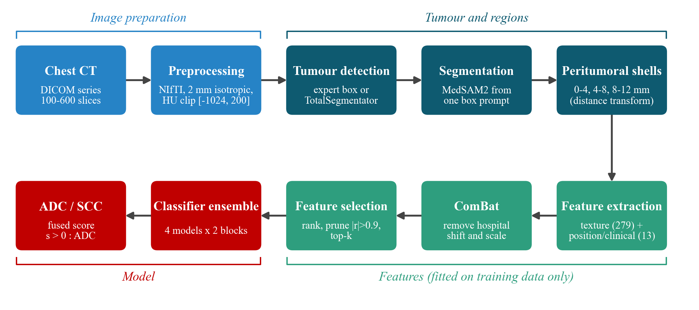
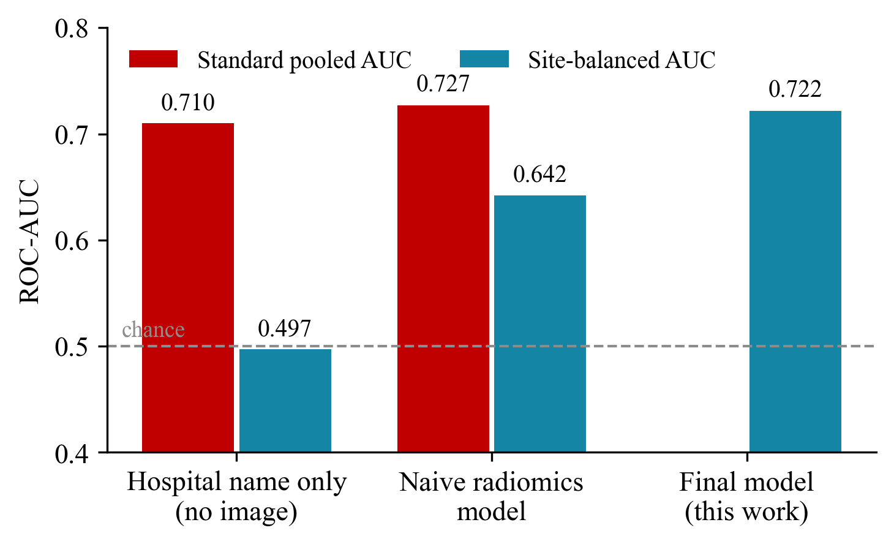
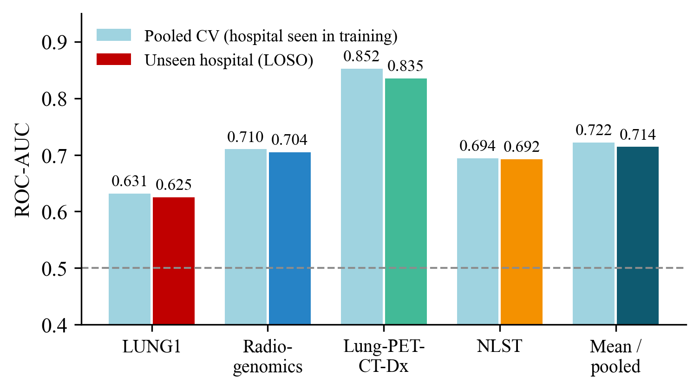
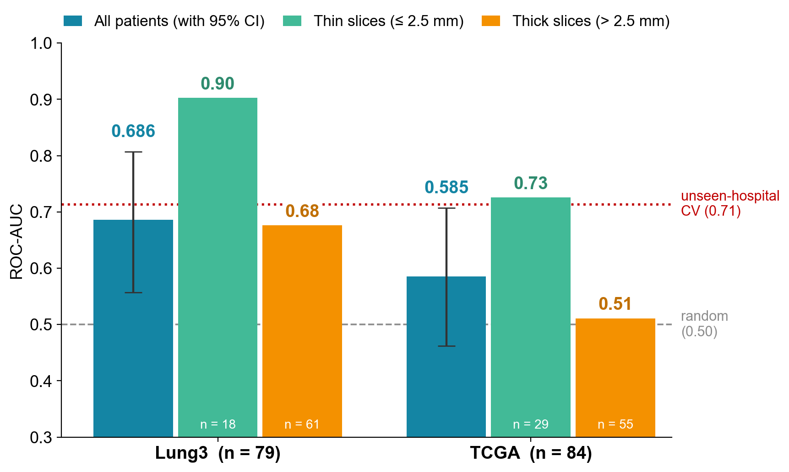

# Telling Lung Adenocarcinoma from Squamous Cell Carcinoma on CT

**Hospital-robust radiomics for ADC vs SCC classification**

EEE 402: Artificial Intelligence and Machine Learning Laboratory, Department of EEE, BUET
Group 13, Lab Group G2. Rahib Mahasin (2106119)
Course instructors: Tanvir Hossain (Lecturer) and Anindya Bhattacharjee (Adjunct Lecturer)

This repository holds the code for a fully automatic CT pipeline that predicts whether a lung tumour is
adenocarcinoma (ADC) or squamous cell carcinoma (SCC). It also holds the evaluation design used to make sure
the result still holds at hospitals the model has never seen.

- Full report: [docs/Group_13_EEE_402_G2_Project_Report.pdf](docs/Group_13_EEE_402_G2_Project_Report.pdf)
- Slides: [docs/Group_13_EEE_402_G2_Project_Presentation.pdf](docs/Group_13_EEE_402_G2_Project_Presentation.pdf)

> **No data is included.** All CT scans come from public archives (TCIA and NCI IDC) and must be downloaded
> from them under their own licences. This repository contains code, configuration files and documentation
> only. It does not contain images, masks, extracted features, predictions or model weights.

---

## Main idea

When CT data from several hospitals are pooled, a model can "cheat". Hospitals differ in scanner style and
also in their ADC/SCC mix: LUNG1 is 75% SCC, while the other three development cohorts are 73% to 81% ADC.
A predictor that knows **only the hospital name** reaches a pooled ROC-AUC of **0.71** without looking at any
image.

This project:

1. measures this hospital shortcut and evaluates with a **site-balanced AUC**, which gives exactly 0.5 to any
   hospital-only predictor;
2. removes scanner differences with **ComBat**, fitted inside every training fold, and maps new hospitals
   without their labels;
3. finds and outlines the tumour automatically with **TotalSegmentator** and **MedSAM2**;
4. extracts texture from three **peritumoral shells** (0-4, 4-8 and 8-12 mm), plus tumour position, size, age
   and sex;
5. classifies with a small ensemble (logistic regression, SVM, LightGBM and ridge) in each of two feature
   blocks, then fuses the two block scores;
6. tests the frozen model once on **two locked, pre-registered external datasets**.



## Results

| Evaluation | Patients | ROC-AUC |
|---|---|---|
| Site-balanced AUC, 5 seeds x 5-fold nested CV | 1041 (4 hospitals) | **0.722** (95% CI 0.687-0.762) |
| Leave-one-hospital-out, mean of 4 unseen hospitals | 1041 | **0.714** |
| Locked external test: Lung3 | 79 | **0.686** (0.557-0.807) |
| Locked external test: TCGA | 84 | **0.585** (0.462-0.707) |

- Thin-slice CT (2.5 mm or less) worked best externally: 0.90 on Lung3 and 0.73 on TCGA. On 5 mm CT the model
  is unreliable.
- In TCGA, every contributing hospital sent only ADC or only SCC patients, so in that dataset the hospital
  equals the label.
- Deep alternatives did not beat the harmonised radiomics model under the same protocol: attention-MIL,
  frozen FMCIB features, CT-FM features, and a fine-tuned CNN with an adversarial hospital head.

| Hospital shortcut | Unseen hospitals | External tests |
|---|---|---|
|  |  |  |

## Data

| Cohort | Role | Patients (ADC/SCC) | Source |
|---|---|---|---|
| LUNG1 (NSCLC-Radiomics) | development | 202 (51/151) | TCIA |
| NSCLC-Radiogenomics | development | 141 (112/29) | TCIA |
| Lung-PET-CT-Dx | development | 301 (244/57) | TCIA |
| NLST, with Sybil tumour boxes | development | 397 (290/107) | NCI IDC + Zenodo |
| Lung3 (NSCLC-Radiomics-Genomics) | locked test | 79 (44/35) | TCIA |
| TCGA-LUAD / TCGA-LUSC | locked test | 84 (48/36) | TCIA |

Inclusion and exclusion rules are described in the report (Section 5.3.2) and in `docs/phase_reports/`.

## Repository layout

```
src/            all Python code (flat, so the scripts can import each other)
config/         YAML configuration (seeds, grids, paths, PyRadiomics settings)
tests/          automated checks written for the early phases
requirements/   pinned package lists for each Python environment
docs/           report, slides, phase reports, pre-registrations, figures
```

### Final pipeline (`src/`)

| Step | Script(s) |
|---|---|
| Cohort selection and download lists | `phase12_select.py`, `phase11_lpcd_build.py` |
| DICOM to NIfTI, 2 mm resampling | `phase12_build.py`, `resample.py` |
| Tumour detection (external data) | `phase14_detect.py` (TotalSegmentator lung nodules) |
| Tumour outlining | `phase13_medsam2.py`, `phase14_segment.py` (MedSAM2 from a box prompt) |
| Features: shells, GTV, position, clinical, FMCIB | `phase12_features.py`, `phase10_extract_shells.py`, `phase10_extract_loc.py`, `phase10_extract_fmcib.py` |
| CT-FM features | `phase13_ctfm.py` |
| ComBat harmonisation | `phase10_harmonise.py` |
| Site-balanced metric, nested CV, models | `phase10_cv.py`, `phase11_cv.py`, `phase12_cv.py` |
| Shortcut demonstration | `phase10_shortcut_demo.py` |
| Adversarial fine-tuning (negative result) | `phase13_advft.py` |
| Locked tests | `phase14_test.py` (TCGA), `phase14b_lung3.py` (Lung3) |
| Report and slide figures | `report_figures.py`, `slides_figures.py`, `build_report.py`, `report_content.py` |

### Early phase: attention-MIL (before the progress presentation)

These scripts hold the weakly supervised local-radiomics attention-MIL experiments on LUNG1 and
Radiogenomics: `patches.py`, `run_extraction.py`, `mil_*.py`, `train_mil*.py`, `clam_mil.py`, `cnn_embed.py`,
`feature_selection.py`, and `phase6*` to `phase9a_*`. Their design is in `docs/early_mil_methodology.md`. They
are kept for completeness. The final model does not use them.

## Setup

Four Python environments were used, because the tools need different Python, NumPy and PyTorch versions.

| Environment | Python | Used for | Packages |
|---|---|---|---|
| radiomics (`.venv`) | 3.9 | PyRadiomics feature extraction | `requirements/requirements-direct.txt` (PyRadiomics 3.1.0 needs Python 3.9 and NumPy < 2) |
| main (`.venv-phase10`) | 3.9 | position/FMCIB features, ComBat, models, evaluation | `requirements/phase10_environment.txt` |
| MedSAM2 (`.venv-medsam2`) | 3.12 | segmentation, CT-FM | `requirements/phase13_environment_medsam2.txt` |
| TotalSegmentator (`.venv-totalseg`) | 3.12 | nodule detection | `requirements/phase14_environment_totalseg.txt` |

Example for the main environment (the `+cu124` PyTorch wheels need the PyTorch package index):

```bash
python -m venv .venv-phase10
.venv-phase10/Scripts/python -m pip install -r requirements/phase10_environment.txt --extra-index-url https://download.pytorch.org/whl/cu124
```

External models are downloaded separately from their official sources, and their weights are not stored
here:

- MedSAM2: https://github.com/bowang-lab/MedSAM2
- TotalSegmentator: https://github.com/wasserth/TotalSegmentator
- FMCIB: Zenodo record 10528450
- CT-FM: `project-lighter/ct_fm_feature_extractor`

All weights are loaded with `torch.load(weights_only=True)` or as safetensors.

**Paths.** The code was run on Windows with data on local drives. For example, `C:/LUNG_phase12/...` holds the
NIfTI files and masks. Data locations are set in `config/*.yaml`, at the top of each script, and through
environment variables (`ADC_COHORT`, `ADC_MASK_ROOT`, `ADC_FEAT_OUT`, `ADC_RES_OUT`). Edit these for your
machine.

## Reproducing the final model

Run from the repository root. The comment on each line names the environment to use.

```bash
# 1. data (after downloading the DICOM series)
python src/phase12_select.py                       # main
python src/phase12_build.py nlst                   # main: DICOM -> NIfTI

# 2. tumour masks
python src/phase13_medsam2.py validate --n 40      # medsam2: choose settings on expert outlines (no labels)
python src/phase13_medsam2.py run --ckpt latest    # medsam2: all 1041 patients

# 3. features
python src/phase12_features.py cohort              # main
python src/phase12_features.py radiomics           # radiomics (PyRadiomics)
python src/phase12_features.py loc                 # main

# 4. models: 5 x 5 nested CV, leave-one-hospital-out, fusion
python src/phase12_cv.py pooled --blocks gtv ring_in shells loc_clin fmcib
python src/phase12_cv.py loso   --blocks gtv ring_in shells loc_clin fmcib
python src/phase12_cv.py fusion --blocks gtv ring_in shells loc_clin fmcib
```

The final model is the fusion `shells + loc_clin` with ComBat.

## Locked external test protocol

1. A pre-registration was written before any external image was processed: `docs/preregistration/`.
2. The external images were processed with the frozen pipeline: TotalSegmentator, then MedSAM2, then
   features, then the model fitted once on the 1041 development patients.
3. Predictions were saved together with their SHA-256 hash **before** the label file was opened.
4. The scoring step reads the labels once and refuses to run again.

```bash
python src/phase14_detect.py detect && python src/phase14_detect.py boxes    # totalseg
python src/phase14_segment.py                                                # medsam2
python src/phase14_test.py clin && python src/phase14_test.py predict        # main: writes + hashes predictions
python src/phase14_test.py score                                             # main: run once
# Lung3: python src/phase14b_lung3.py convert|detect|segment|clin|predict|score
```

## Acknowledgements

Data: The Cancer Imaging Archive (TCIA), the NCI Imaging Data Commons, the National Lung Screening Trial and
the Sybil project. Tools: PyRadiomics, SimpleITK, scikit-learn, LightGBM, PyTorch, MedSAM2, TotalSegmentator,
FMCIB and CT-FM. The full reference list is in the report.

This is a course research project. It is not a medical device and must not be used for clinical decisions.
